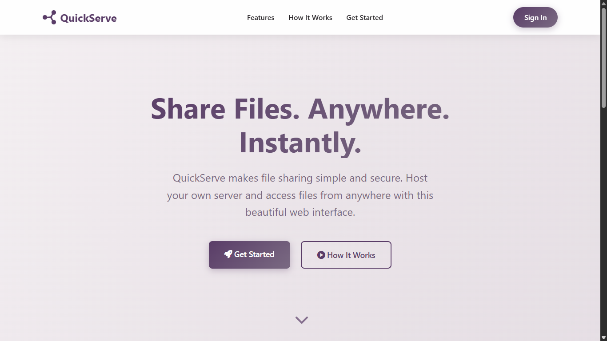

# QuickServe - FastAPI File Server

A lightweight, self-hosted file server with web interface for easy file sharing and management.



Learn more at: [https://quickserve.noman.qzz.io/](https://8gudbits.github.io/quickserve.noman)

## Quick Start

Get the latest release from [here](https://github.com/8gudbits/QuickServe/releases).

### 1. Configuration

Before running the server, configure it using the built-in configurator:

```bash
cd backend
python qconfig.py
```

This launches an interactive menu where you can:

- Set server port (default: 5000)
- Configure CORS origins
- Add user accounts with passwords
- Manage server settings

### 2. Running the Server

```bash
python quickserve.py
```

The server will start and display access URLs for both local and network access.

## Frontend Configuration

### Using Official Frontend

To use the official web interface at `https://quickserve.noman.qzz.io`, you must allow it as a CORS origin in your configuration:

1. Run python `qconfig.py`
2. Select "Manage CORS Origins"
3. Add `https://quickserve.noman.qzz.io` to allowed origins

### Self-Hosted Frontend

Alternatively, you can host the frontend files yourself:

1. Serve the `frontend/` directory with any web server
2. Add your frontend URL to CORS origins in the configuration
3. Access your self-hosted interface instead

## Features

- Secure Authentication - BCrypt-hashed passwords with SHA-256 pre-hashing
- File Browser - Web-based file navigation and management
- File Upload - Upload with duplicate protection
- File Download - Direct file downloads with proper MIME types
- CORS Support - Configurable cross-origin resource sharing

## Security Notes

- CORS origins should be properly configured for use
- Default configuration allows all origins (`*`) - restrict this for production

## Requirements

Install Python dependencies:

```bash
pip install -r backend/requirements.txt
```

## Access

After starting the server, access it via:

- Local: `http://localhost:{port}`
- Network: `http://{your-ip}:{port}`

Use the web interface to login and manage files.

