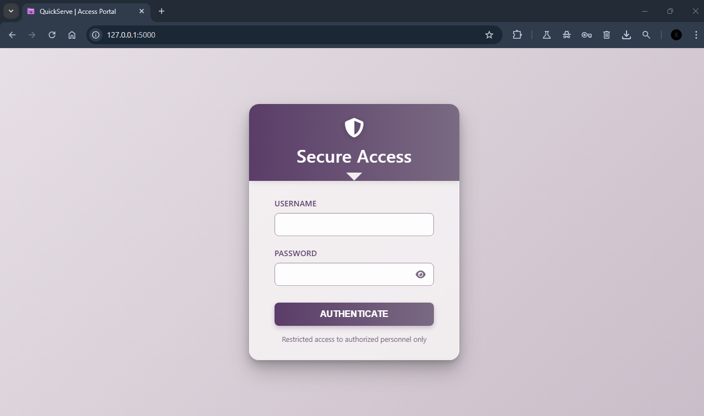
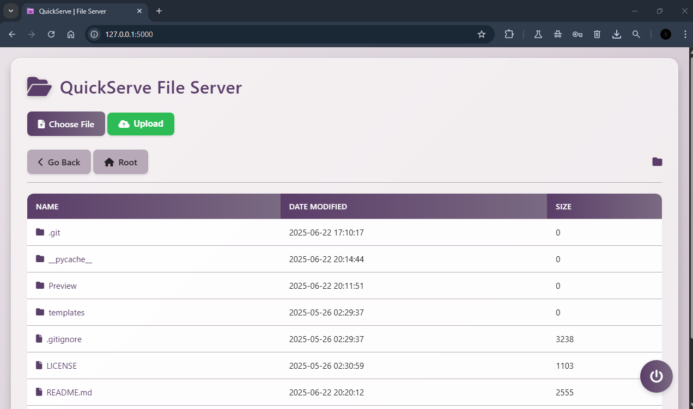
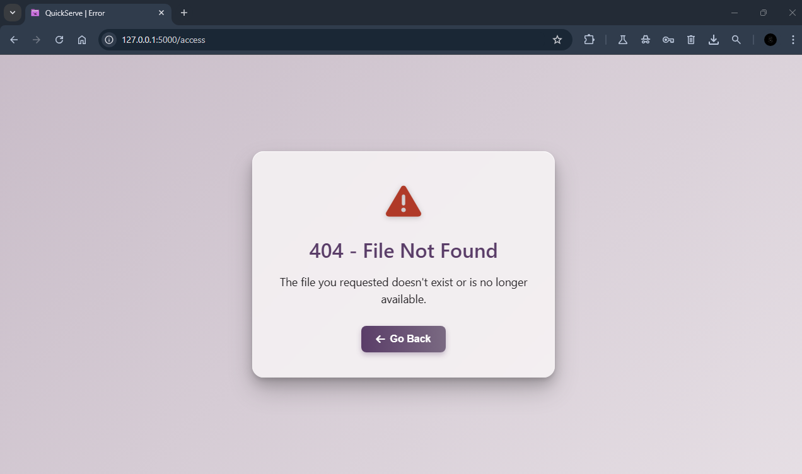

# QuickServe: A Server to Serve files from your disk.

## Introduction

**Share Files Instantly—Directly from Your Device or Let Others Share with You.**

- Your computer = the server. No uploads, no limits.
- Send huge files fast, skip the cloud middleman.
- Unlimited space & bandwidth—share freely, without waiting.

## Features

- User authentication using username and password
- Browse files and directories from the web interface
- Upload and download files to the server from the web interface
- Built-in anti-DDoS protection

## Installation


#### Get the latest release for windows from here. [[Version-v2.0]](https://github.com/8gudbits/QuickServe/releases)

- **or:**

1. Clone the repository:

   ```bash
   git clone https://github.com/8gudbits/QuickServe.git
   ```

2. Install the required dependencies using pip:

   ```bash
   pip install -r requirements.txt
   ```

3. Run the application:

   ```bash
   python QuickServe.py
   ```

4. Open your web browser and navigate to `http://localhost:5000` to access the file server.

## Usage

To get started, simply open the `config.json` file and create user accounts with usernames and passwords like this:

```json
{
  "users": {
    "username_1": "password_for_this_user",
    "username_2": "super_strong_password",
    "username_3": "anotherexamplepassword"
  }
}
```

To change the port number, open the `config.py` file and change the `port` variable to the desired port number like this:

```json
{
  "users": {
    "username_1": "password_for_this_user",
    "username_2": "super_strong_password",
    "username_3": "anotherexamplepassword"
  },
  "port": 5000
}
```

After that, you can run the QuickServe app and the current folder will become the root directory. `QuickServe` executable, `config.json` and `favicon.ico` files will not be accessible from the web interface. If you want to run the app as a python script, make sure to copy `config.json` and `templates.py` along with the `QuickServe.py` file in the same directory. Don't forget to install the required dependencies using `pip install -r requirements.txt`.

- The login page allows users to authenticate using their username and password.
- After logging in, users can browse files and directories on the server.
- Use the "Upload File" button to upload files to the server.
- Click on a folder name to navigate into that folder.
- Click on a file name to download the file.
- Use the "Go back" button to navigate to the parent directory.
- Use the "Root" button to navigate back to the root directory.
- Click on the logout button to log out of the web interface.

## Screenshots





## License

This project is licensed under the [MIT License](LICENSE).

---

Built with ❤️ using Python and Flask.
